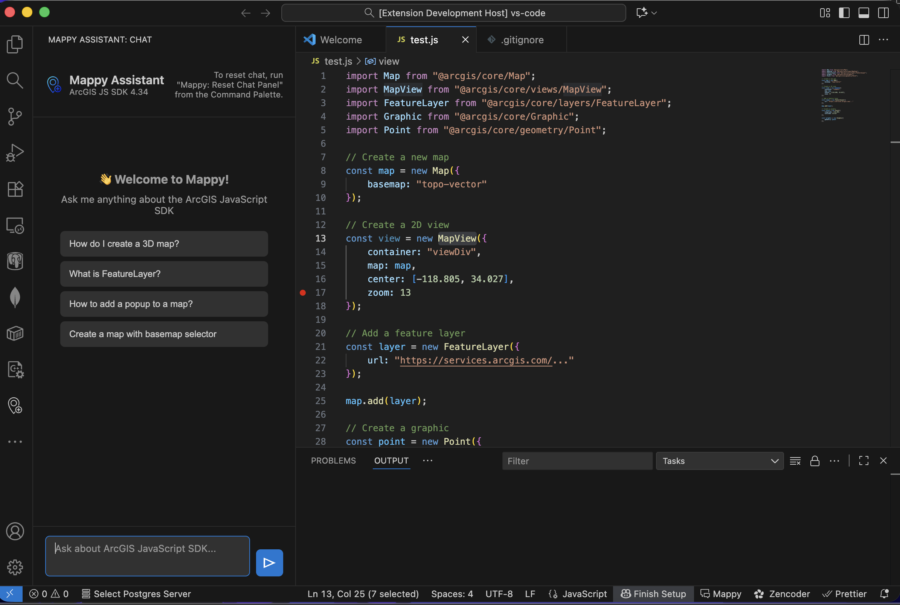
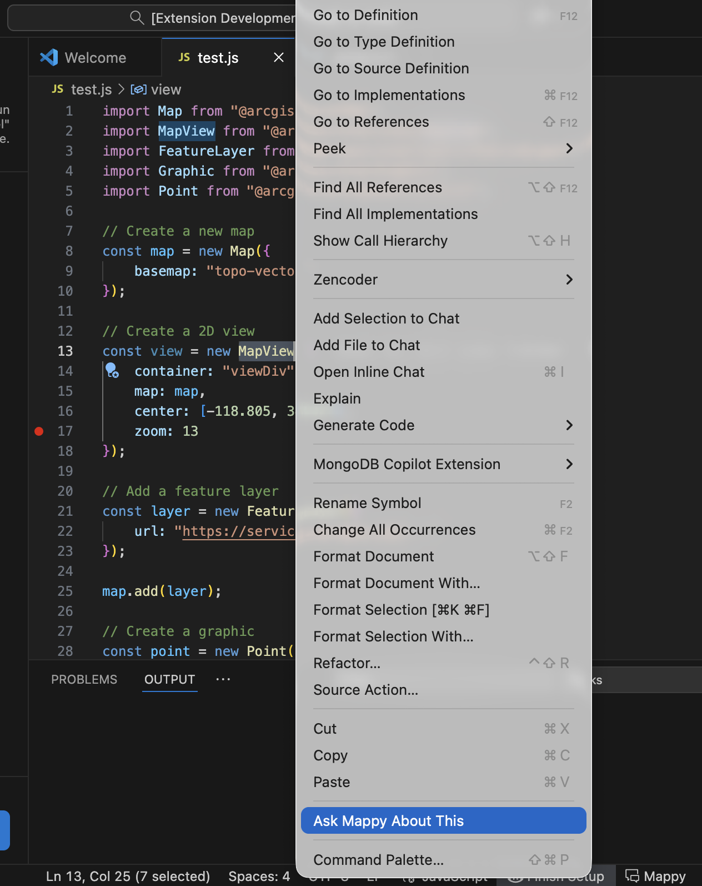
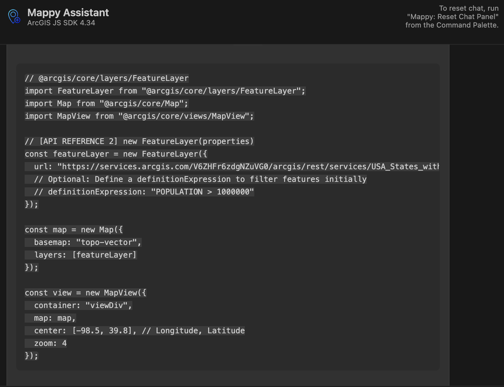
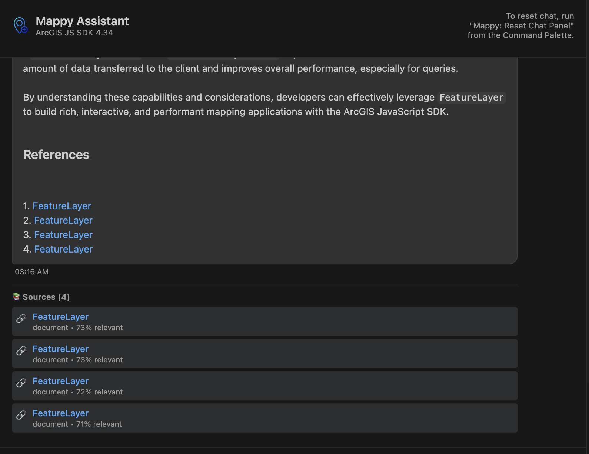

# 🗺️ Mappy - ArcGIS JavaScript SDK Documentation Assistant

**Your AI-powered companion for ArcGIS JavaScript SDK development**

Get instant answers, code examples, and context-aware help directly in VS Code. Powered by advanced RAG (Retrieval-Augmented Generation) technology with the complete ArcGIS JavaScript SDK 4.34 documentation.

[](https://marketplace.visualstudio.com/items?itemName=ajitsingh.mappy-js-sdk)
[](https://github.com/asing349/Mappy-ArcGIS-JS-Assistant)
[](LICENSE)

---

## ✨ Features

### 💬 **AI Chat Sidebar**

- Ask questions in natural language
- Get accurate answers from official ArcGIS docs
- See source citations with relevance scores
- Persistent chat history across sessions

### 🎯 **Right-Click Context Menu**

- Right-click any ArcGIS class name
- Select "Ask Mappy About This"
- Instant documentation lookup
- Zero friction workflow

### 📝 **Smart Code Examples**

- Get working code snippets
- Copy with one click
- Insert directly into your editor
- Syntax-highlighted output

### 🔍 **Source Citations**

- Each answer comes with sources cited
- Includes relevance score out of 100%
- Helps verify accuracy and trustworthiness

### ⚡ **Performance Optimized**
- Response caching (5-minute TTL)
- Fast API responses
- Minimal resource usage
- Works offline with cached results

---

## 🚀 Getting Started

### Installation

1. Open VS Code
2. Go to Extensions (Ctrl+Shift+X / Cmd+Shift+X)
3. Search for "Mappy"
4. Click "Install"

Or install via command line:
```bash
code --install-extension ajitsingh.mappy-js-sdk
```

### Usage

#### **Method 1: Chat Sidebar**
1. Click the Mappy icon in the Activity Bar (left sidebar)
2. Type your question about ArcGIS JavaScript SDK
3. Press Enter or click Send
4. Get instant answers with code examples!

**Example questions:**
- "How do I create a 3D map?"
- "What properties does MapView have?"
- "Show me how to add a popup to a FeatureLayer"
- "How to use SceneView with custom basemap?"

#### **Method 2: Right-Click Menu**
1. Place your cursor on any ArcGIS class name (e.g., `MapView`, `FeatureLayer`)
2. Right-click → "Ask Mappy About This"
3. Chat opens with pre-filled question
4. Edit if needed and press Enter

#### **Method 3: Command Palette**
- `Ctrl+Shift+P` / `Cmd+Shift+P`
- Type "Mappy: Ask Question"
- Enter your question

---

## 📸 Screenshots

### Chat Sidebar
Ask questions and get instant answers with code examples:

```
User: How do I create a 2D map with a popup?

Mappy: Here's how to create a 2D map with a popup:

[Code example with MapView, Popup, and FeatureLayer]

Sources:
📚 MapView | Esri Documentation (95% relevant)
📚 Popup | Esri Documentation (88% relevant)
```

### Right-Click Context Menu
Hover over any ArcGIS class and ask Mappy:

```javascript
import MapView from "@arcgis/core/views/MapView";
                      ↑
              [Right-click here]
              → "Ask Mappy About This"
```

---

## ⚙️ Configuration

Access settings via: `File → Preferences → Settings → Search "Mappy"`

### Available Settings

| Setting | Default | Description |
|---------|---------|-------------|
| `mappy.apiUrl` | `https://mappy-arcgis-js-assistant-production.up.railway.app` | API endpoint (use default or your own instance) |
| `mappy.enableChat` | `true` | Enable/disable chat sidebar |
| `mappy.cacheTimeout` | `300` | Cache timeout in seconds (5 minutes) |
| `mappy.sdkVersion` | `4.34` | ArcGIS JavaScript SDK version |

---

## 🎯 Use Cases

### **Learning the SDK**
New to ArcGIS JavaScript SDK? Ask Mappy to explain concepts, show examples, and guide you through common tasks.

### **Quick Reference**
Forgot a property name or method signature? Right-click and ask Mappy for instant reference.

### **Code Generation**
Need a working example? Ask Mappy and get copy-paste ready code snippets.

### **Troubleshooting**
Stuck on an error? Describe the issue and get contextual help from official docs.

---

## 🛠️ Commands

Access via Command Palette (`Ctrl+Shift+P` / `Cmd+Shift+P`):

- **Mappy: Open Chat** - Open the chat sidebar
- **Mappy: Ask Question** - Quick question input
- **Mappy: Ask Mappy About This** - Ask about symbol under cursor
- **Mappy: Test API Connection** - Verify backend connectivity
- **Mappy: Clear Cache** - Clear response cache
- **Mappy: Reset Chat Panel** - Clear chat history

---

## 🔧 Requirements

- **VS Code** 1.85.0 or higher
- **Internet connection** (for API queries)
- **Supported languages:** JavaScript, TypeScript, HTML

---

## 📊 What's Under the Hood?

Mappy uses:
- **RAG (Retrieval-Augmented Generation)** for accurate, source-based answers
- **Vector database** with 34,000+ documentation embeddings
- **Claude AI** for natural language understanding
- **ArcGIS JavaScript SDK 4.34** complete documentation
- **FastAPI backend** hosted on Railway
- **Response caching** for speed and efficiency

---

## 🆘 Troubleshooting

### Extension not responding?
1. Check internet connection
2. Run: **Mappy: Test API Connection**
3. Check Output panel: `View → Output → Mappy Assistant`

### Getting error messages?
1. Verify API URL in settings
2. Clear cache: **Mappy: Clear Cache**
3. Reload VS Code window

### Chat not showing?
1. Click Mappy icon in Activity Bar
2. Or run: **Mappy: Open Chat**

---

## 🤝 Contributing

Found a bug or have a feature request?
- **GitHub Issues:** [Report here](https://github.com/asing349/Mappy-ArcGIS-JS-Assistant/issues)
- **GitHub Repo:** [View source](https://github.com/asing349/Mappy-ArcGIS-JS-Assistant)

---

## 📄 License

MIT License - see [LICENSE](LICENSE) file for details

---

## 🌟 About

Mappy is built by developers, for developers. Our mission is to make ArcGIS JavaScript SDK development faster and more enjoyable by bringing AI-powered documentation assistance directly into your workflow.

**Try the web version:** [mappy-js-sdk.vercel.app](https://mappy-js-sdk.vercel.app)

---

## 🔗 Links

- [VS Code Marketplace](https://marketplace.visualstudio.com/items?itemName=ajitsingh.mappy-js-sdk)
- [GitHub Repository](https://github.com/asing349/Mappy-ArcGIS-JS-Assistant)
- [Web App](https://mappy-js-sdk.vercel.app)
- [Report Issues](mailto:asing349@ucr.edu)

---

**Made with ❤️ for the ArcGIS developer community**

*Happy mapping!* 🗺️✨